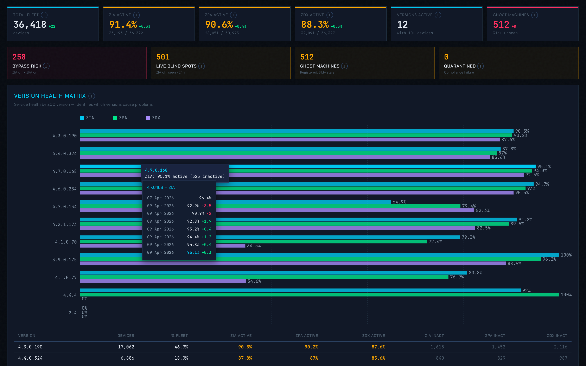

# ZCC Fleet Tracker

A fleet health dashboard generator for **Zscaler Client Connector (ZCC)** deployments. Processes ZCC Portal CSV exports and produces interactive HTML+PDF dashboards with D3.js visualizations.

---

**Copyright (c) 2025 ZHERO srl, Italy**
**Website:** [https://zhero.ai](https://zhero.ai)

This project is released under the MIT License. See the [LICENSE](LICENSE) file for full details.

---

## Purpose

During ZCC client upgrades, rollbacks, or fleet-wide incidents, security teams need fast visibility into which versions, policies, and regions are affected. ZCC Portal exports provide the raw data, but turning 36,000+ device rows into actionable intelligence requires parsing, cross-referencing, and visualization.

**ZCC Fleet Tracker** bridges that gap: drop your CSV exports into a folder, run one command, and get a publication-ready dashboard showing exactly where the problems are.

## Key Features

- **Version Health Matrix** — service health (ZIA/ZPA/ZDX) broken down by ZCC version, instantly revealing which versions cause problems
- **Multi-snapshot comparison** — load N exports over time, track fleet metrics across snapshots with temporal charts
- **Snapshot selector** — switch between snapshots instantly, all charts re-render client-side
- **Country filter** — filter the entire dashboard by country (extracted from hostname prefix)
- **Temporal hover** — hover any data point to see its value across all snapshots with deltas
- **Security posture** — bypass risk, live blind spots, ghost machines, quarantined devices
- **Policy analysis** — health breakdown by assigned ZCC policy
- **Info tooltips** — every metric has an explanation of how it's computed
- **Zero dependencies** — Python 3.8+ standard library only, no `pip install` needed
- **Interactive HTML** — D3.js charts with tooltips, responsive dark-theme layout
- **PDF export** — via headless Chrome for email sharing

## Screenshot



## Quick Start

### 1. Export CSVs from ZCC Mobile Admin Portal

Go to the **Zscaler Client Connector Mobile Admin Portal** and navigate to:

> **Enrolled Devices**

From there, download **two exports**:

| Export | Button | Produces |
|--------|--------|----------|
| **Device Details (All Fields)** | `Export` dropdown > `Device Details (All Fields)` | `device_export_YYYY_MM_DD-HH-MM-SS.csv` |
| **Service Status** | `Export` dropdown > `Service Status` | `service_status_export_YYYY_MM_DD-HH-MM-SS.csv` |

Repeat the export at different times to capture multiple snapshots (e.g., before upgrade, after upgrade, after revert).

### 2. Drop all CSVs into one folder

Put all your exports — from any number of snapshots — into a single folder. The tool will automatically pair each `service_status_export` with the closest `device_export` by timestamp (within 12 hours).

```
snapshots/
  device_export_2026_04_07-08-08-15.csv
  service_status_export_2026_04_07-13-00-07.csv
  device_export_2026_04_09-05-57-32.csv
  service_status_export_2026_04_09-05-57-42.csv
  device_export_2026_04_09-09-37-05.csv
  service_status_export_2026_04_09-09-37-10.csv
```

You can use the default `snapshots/` directory inside the project, or point to any folder.

### 3. Generate Dashboard

```bash
# Auto-detect from ./snapshots/ (default)
python3 generate_dashboard.py

# Point to a specific directory
python3 generate_dashboard.py /path/to/csv/folder/

# Custom output path, skip PDF, skip browser
python3 generate_dashboard.py --out ~/Desktop/report.html --no-pdf --no-open
```

### 4. View & Share

The dashboard opens automatically in your browser. Share the `.html` file directly (self-contained, works offline after first load) or the exported `.pdf` via email.

## Requirements

- **Python 3.8+** (standard library only)
- **Google Chrome or Chromium** (optional, for PDF export)
- **Internet connection** (for D3.js and fonts from CDN on first load)

Run `bash install.sh` to verify your environment.

## Dashboard Sections

| Section | Description |
|---------|-------------|
| **KPI Cards** | Total fleet, ZIA/ZPA/ZDX active %, versions in play, ghost machines. Includes delta from previous snapshot. |
| **Security Alerts** | Bypass risk, live blind spots, ghost machines, quarantined devices |
| **Version Health Matrix** | Health % by ZCC version — the key analysis for upgrade/revert incidents |
| **Fleet Composition** | Version distribution (horizontal bar chart) |
| **Service Health** | ZIA/ZPA/ZDX donut charts |
| **Policy Health** | Health by policy (ZIA + ZPA grouped bars) |
| **Device Staleness** | Last-seen age distribution histogram |
| **Tunnel / Revert / Trust / OS** | Supporting breakdowns |
| **Temporal Comparison** | Health + version trends across snapshots (multi-snapshot only) |

## Multi-Snapshot Workflow

For tracking an upgrade/revert cycle:

1. Export CSVs **before** the change
2. Export CSVs **after** the upgrade
3. Export CSVs **after** the revert
4. Drop all exports into `snapshots/`
5. Run `python3 generate_dashboard.py`

The snapshot selector lets you switch between points in time. The temporal section shows trends. Hover any data point to see its evolution across all snapshots.

## Country Filter

The dashboard extracts country codes from the first two characters of device hostnames (e.g., `ESBA01817N` = ES, `DE0203001S` = DE). Click any country pill to filter the entire dashboard — all charts, KPIs, tables, and temporal comparisons update to show only that country's data.

## Troubleshooting

| Issue | Solution |
|-------|----------|
| `ERROR: No service_status_export / device_export CSVs found` | Ensure CSV filenames contain `service_status_export_` or `device_export_` |
| `ERROR: Cannot match service/device CSV pairs` | Files are paired by closest timestamp (within 12h). Check filenames contain timestamps like `2026_04_09-05-57-32` |
| PDF not generated | Install Google Chrome or Chromium. Run `bash install.sh` to verify. |
| Charts don't render | Requires internet for D3.js CDN on first load. |

## License

MIT License. See [LICENSE](LICENSE).

**Developed by [ZHERO srl](https://zhero.ai) - Zscaler Security Operations Tools**
